## Selected work

**[ShambaLens AI](https://github.com/tbrowns/shambalens-ai)** — evidence-first crop triage for Kenyan smallholders

Most crop classifiers give you one confident label and hide the uncertainty. ShambaLens does the opposite: it gates the photo on quality first, records only what's visibly there, then ranks up to three competing causes and asks the farmer up to three questions *chosen for their ability to separate the leaders*. The ranking is revised from those answers, an independent pass verifies evidence and calibration, and deterministic guardrails strip unsafe chemical instructions even if the model generates them.

`FastAPI` `Next.js` `Postgres + Alembic` `Firebase Storage` `vision + LLM` — 19 tests, CI against a live Postgres service

---

**[Mindbase](https://github.com/tbrowns/mind-base)** — cited answers over an internal knowledge base · [live](https://mind-base-nine.vercel.app)

Ingests internal documents, meeting transcripts and a Gmail inbox; masks obvious personal data before anything is stored; chunks and indexes to Pinecone. Retrieved chunks are filtered for relevance *before* they reach the model, so answers stay grounded and every claim carries a source. Missing credentials fail loudly rather than silently degrading to a worse provider.

`Next.js 16` `React 19` `Pinecone` `Groq` `Firestore`

---

**[DRIP Orchestrator](https://github.com/tbrowns/drip_orch_platform)** — dividend reinvestment for the Nairobi Securities Exchange

NSE data isn't available in the tools that model dividend reinvestment, so I built the piece that was missing: live quote scraping, dividend history tracking, and simulation of what reinvested dividends actually compound into over time.

`FastAPI` `SQLAlchemy` `JWT auth` `web scraping`

---

**[Finly](https://github.com/tbrowns/finly_platform)** — AI financial controller for founders

Pulls monthly books from Zoho, normalises them into Postgres, then runs four *deterministic* checks — cash-flow risk, fraud indicators, personal/business account mixing, reconciliation. The model only writes the explanation; it never decides whether something is wrong. That split is the whole design.

`FastAPI` `Zoho OAuth2` `Neon Postgres` `Groq`

## How I build

The through-line in the work above is keeping the model on a short leash. Finly decides with deterministic code and lets the LLM narrate. ShambaLens makes uncertainty visible instead of collapsing it into one label, and runs a separate verification pass before a farmer sees anything. Mindbase filters retrieved context before generation rather than hoping the model ignores the noise.

I'd rather ship something narrow that holds up than something broad that demos well.

## Stack

| | |
|---|---|
| **Backend** | Python · FastAPI · SQLAlchemy · Node.js · Express |
| **Frontend** | TypeScript · Next.js · React · Tailwind · shadcn/ui |
| **Data** | PostgreSQL · Neon · Supabase · Firestore · Pinecone |
| **AI** | RAG pipelines · embeddings · vector search · Groq · Gemini · vision models |
| **Infra** | Docker · GitHub Actions · Vercel · nginx |

## Elsewhere

[Portfolio](https://obande.netlify.app/) · [LinkedIn](https://www.linkedin.com/in/tom-obande-13811a1a8) · [tb.obande@gmail.com](mailto:tb.obande@gmail.com)
